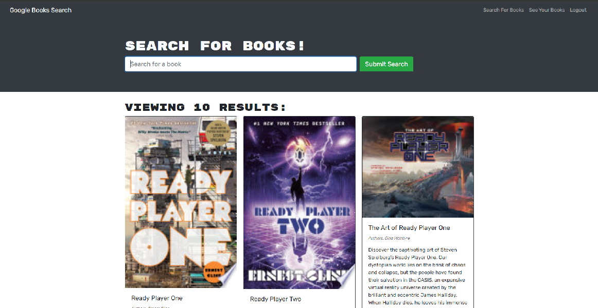

# Book Search Refactor

## Description
The purpose of this challenge was to take an existing, and fully functional book search website using a RESTful API, and refactor the code so that it uses Apollo Server and graphQL instead.

## Usage
To use the site, begin by Signing up or Logging in.

Once you are logged in, Use the search box to search for books, using the Google Books API.

Click `Save Book` to add it to a saved list.

To view your list, click the `View Saved Books` link in the upper right.

To remove a book from you list, click the `Delete` button under that book in the Saved Books list.

## Live Site
[Visit Site](https://cbc-book-search.herokuapp.com/)

## Author
Elliott Kvamme, 2022